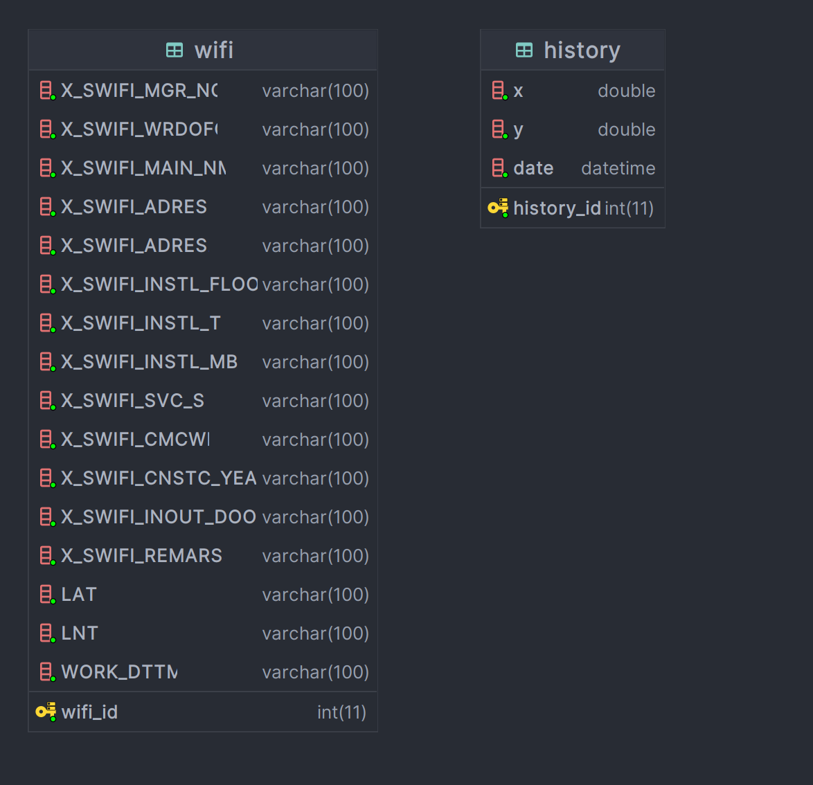

# 내 위치 기반 공공 WIFI 제공 sevlet 서비스

## 프로젝트 기간

- 2024.03.25 ~ 2024.04.08

## 주요 기능
1. 서울공공데이터 api를 활용하여 공공 와이파이 정보 가져오기 기능 구현 -> [공공 와이파이 데이터 db저장 시 시간 단축(15575ms -> 4625ms)](https://velog.io/@yjj7819/%EB%8C%80%EB%9F%89-%EB%8D%B0%EC%9D%B4%ED%84%B0-%EC%BF%BC%EB%A6%AC-%EC%8B%9C%EA%B0%84-%EB%8B%A8%EC%B6%95addBatch-excuteBatch#addbatch%EB%A5%BC-%EC%82%AC%EC%9A%A9%ED%95%9C-%EB%A6%AC%ED%8E%99%ED%86%A0%EB%A7%81)
2. 입력한 위치 정보 기반 가까운 공공 와이파이 정보 20개 보여주는 기능 구현
3. 가까운 공공 과이파이 정보를 조회하는 시점에 입력한 위치 정보와 조회한 날짜를 저장한 히스토리를 DB에 저장 및 보여주는 기능 구현
4. 히스토리 삭제 기능 구현

## 사용 기술

- API
  - [서울공공데이터](https://data.seoul.go.kr/dataList/OA-20883/S/1/datasetView.do)  
- 개발 환경
  - inteliJ IDEA, Maven, JDBC
  - lombok 1.18.24, Tomcat 8.5, gson 2.9.0, okhttp3 4.9.3

## ERD

|                                                            전체 테이블                                                            |                                                          api 가져오기                                                          |
|:----------------------------------------------------------------------------------------------------------------------------:|:--------------------------------------------------------------------------------------------------------------------------:|
|                                                                                         |        |
|                                                  **위치 기반 근처 wifi 20개 가져오기**                                                  |                                                     **히스토리 가져오기 / 삭제**                                                     |
|  |  |

## 기능 수행 영상

|                                                       api를 통해 공공 데이터 가져오기                                                       |                                                       입력한 위치 기반 가까운 와이파이 정보 20개 보여주기                                                       |                                                       히스토리 보여주기 및 히스토리 삭제                                                       |
|:-------------------------------------------------------------------------------------------------------------------------------:|:------------------------------------------------------------------------------------------------------------------------------------------:|:-------------------------------------------------------------------------------------------------------------------------------:|
|  |  |  |